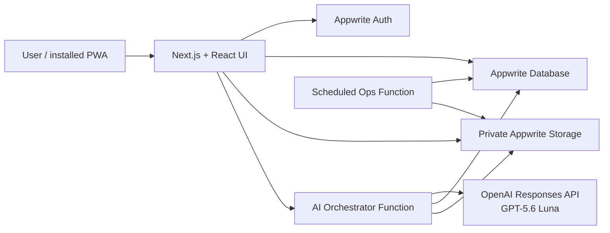

# LifeInbox

> Turn screenshots, receipts, PDFs, voice notes, and messy thoughts into clear next steps.

[](https://openai.devpost.com/)
[](https://developers.openai.com/api/docs/models/gpt-5.6-luna)
[](https://appwrite.io/)
[](LICENSE)

**Live project:** [lifeinbox-calm.explorertaha.chatgpt.site](https://lifeinbox-calm.explorertaha.chatgpt.site/)
**OpenAI Build Week track:** Apps for Your Life

LifeInbox is a private, mobile-first life-admin assistant. Users capture whatever is occupying their head, review the structured item GPT-5.6 extracts, and work from a calm Today view, searchable inbox, connected Life Threads, and an Ask experience grounded only in their own saved items.

## Why this exists

Life admin arrives through too many channels: a screenshot of a flight, a voice reminder, a receipt, a PDF renewal notice, or a half-finished thought. Traditional task apps ask the user to organize everything before it becomes useful. LifeInbox reverses that workflow:

1. Capture first.
2. Let GPT-5.6 find the useful structure.
3. Review before saving.
4. Act from one connected, searchable workspace.

## Judge quick test

The fastest path requires no credentials and no local setup:

1. Open the [live project](https://lifeinbox-calm.explorertaha.chatgpt.site/).
2. Choose **Explore the demo** to inspect the complete responsive UI with sample data.
3. For the real persistence flow, create a temporary account.
4. Capture: `Tomorrow at 3 PM, call Dr Mehta to confirm my dental appointment. This is urgent and belongs with my Health plan.`
5. Review the extracted type, priority, date, summary, confidence, and suggested Life Thread.
6. Approve it, refresh the page, and confirm that the item persists.
7. Open **Ask LifeInbox** and ask `What should I do first?` to see a grounded answer with a clickable citation.
8. Open **Life Threads**, delete the Health thread, and confirm that its item remains safely in the inbox.
9. Delete the temporary workspace from **Settings → Privacy**.

Demo mode is intentionally isolated from authenticated accounts. New real accounts always start with an empty workspace.

## What is implemented

- Appwrite email/password sign-up, login, session restore, recovery, and logout
- Real empty workspaces with demo data isolated to explicit demo mode
- Text, image, PDF, and browser-recorded voice capture
- GPT-5.6 Luna structured extraction with schema validation and safe retry behavior
- Editable review flow with confidence and missing-information handling
- Permissioned Appwrite rows and files owned by the signed-in user
- Today briefing generated from current high-priority and dated items
- Searchable, filterable inbox with complete, snooze, detail, and delete actions
- Life Thread creation, AI suggestions, persistent linking, and non-destructive deletion
- Ask LifeInbox answers grounded in user data with clickable item citations
- Preference storage, retention controls, JSON export, and full workspace deletion
- Installable PWA with offline app shell, custom icons, safe areas, and install guidance
- Phone bottom navigation, compact tablet rail, full desktop shell, and full-screen mobile capture/review
- Appwrite setup automation for five collections, one file bucket, indexes, and permissions
- Server-side AI orchestration, usage accounting, file cleanup, and operational controls

## Architecture



The browser receives only public Appwrite identifiers. `OPENAI_API_KEY`, `OPS_SECRET`, and the one-time Appwrite bootstrap key never enter the client bundle. Appwrite Functions use scoped dynamic execution keys and every saved row/file is permissioned to its owner.

## How GPT-5.6 is used

LifeInbox uses the OpenAI Responses API with `gpt-5.6-luna` inside the Appwrite `ai-orchestrator` function.

- **Capture extraction:** converts unstructured text, images, PDFs, and voice transcripts into a strict schema for tasks, events, expenses, and notes.
- **Grounded questions:** retrieves relevant user-owned actions first, then asks GPT-5.6 to answer only from that supplied context and cite supporting item IDs.
- **Daily briefings:** summarizes at most three relevant next steps and caches them by date and item-version hash.
- **Life Thread grouping:** proposes groups only when deterministic relationships are unavailable.

AI output is treated as untrusted input. The function validates structured output, retries empty or malformed responses, strips internal-only extraction fields, records usage, and never claims that an external action was completed.

## How Codex was used

Codex was the primary engineering collaborator across the submission-period build. It accelerated:

- Converting the initial product prompt into the working React/Appwrite architecture
- Implementing authentication, database schemas, indexes, file storage, and two server functions
- Building and polishing responsive phone, tablet, desktop, and PWA experiences
- Tracing live Appwrite execution failures to empty structured output and schema-unsafe persistence
- Migrating the production model to GPT-5.6 Luna and hardening parsing/retry behavior
- Separating demo state from real accounts and replacing fake dashboard values with real calculations
- Implementing persistent Life Threads, grounded citations, deletion, and account cleanup
- Running lint, builds, automated tests, production deployment, and full browser smoke tests

### Decisions kept human-directed

- The product problem: life admin should be captured before it is organized.
- The calm-but-playful product direction and review-before-save trust model.
- Appwrite as the BaaS and the choice to keep all AI secrets in server functions.
- Non-destructive Life Thread deletion: deleting a group must not delete its underlying items.
- GPT-5.6 Luna as the production model for a practical intelligence/cost balance.

The dated commit history provides submission-period implementation evidence. The production repair and real-data work are captured in commits `62b5257` and `6d80844`.

## Run locally

### Prerequisites

- Node.js 22.13 or newer
- npm

### Demo UI

```bash
git clone https://github.com/heytaha14/lifeinbox.git
cd lifeinbox
npm install
npm run dev
```

Open `http://localhost:3000` and choose **Explore the demo**. This path supplies sample data and does not require Appwrite or OpenAI credentials.

### Full Appwrite + OpenAI setup

Copy the example environment file:

```bash
cp .env.example .env.local
```

On Windows PowerShell:

```powershell
Copy-Item .env.example .env.local
```

Then follow [docs/SETUP.md](docs/SETUP.md). In short:

1. Create an Appwrite project and add `localhost` as a Web platform.
2. Add the public Appwrite endpoint/project values and one-time bootstrap key to `.env.local`.
3. Run `npm run appwrite:setup` to create collections, indexes, permissions, and storage.
4. Deploy the Appwrite functions.
5. Add `OPENAI_API_KEY` and `OPENAI_MODEL=gpt-5.6-luna` only to the AI function.
6. Add `OPS_SECRET` and `FILE_RETENTION_DAYS=30` only to the Ops function.
7. Restart the app and create a real account.

Never commit `.env.local` or expose the OpenAI/Appwrite secret keys through a `NEXT_PUBLIC_` variable.

## Appwrite resources

| Resource | ID | Purpose |
|---|---|---|
| Database | `lifeinbox` | Structured user data |
| Collection | `captures` | Original capture metadata and processing state |
| Collection | `actions` | Reviewed tasks, events, expenses, and notes |
| Collection | `threads` | Connected action groups |
| Collection | `briefings` | Versioned daily briefing cache |
| Collection | `usage` | Capture, token, OCR, STT, cache, and failure counters |
| Bucket | `inbox-files` | Private original uploads, limited to 10 MB |
| Function | `ai-orchestrator` | Extract, Ask, brief, and grouping routes |
| Function | `ops` | Retention, deletion, export, and operational seams |

## Quality and verification

```bash
npm run lint
npm test
node --check functions/ai-orchestrator/src/main.js
node --check functions/ops/src/main.js
```

The production flow was verified with a temporary account through sign-up, empty-state rendering, GPT-5.6 extraction, approval, reload persistence, generated briefing, grounded Ask citation, Life Thread deletion, responsive breakpoints, and full workspace deletion. The temporary account was removed after the test.

## Documentation

- [Production setup](docs/SETUP.md)
- [Architecture](docs/ARCHITECTURE.md)
- [API and function routes](docs/API.md)
- [Security and privacy](docs/SECURITY.md)
- [Appwrite Free operations](docs/APPWRITE_FREE.md)
- [Operations runbook](docs/RUNBOOK.md)
- [Build Week submission pack](docs/BUILD_WEEK_SUBMISSION.md)

## License

LifeInbox is available under the [MIT License](LICENSE).
